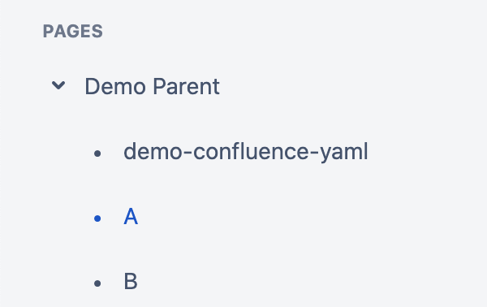

# markdown2confluence
Push markdown files to Confluence Cloud

## Customization

 - `--all <string>` this option allows you to run ALL files named <string>
 
     example:
     ```bash
    markdown2confluence --all "confluence.yml"
    ```
 - `--dry-run` print off your loaded configs for a given set of configs (combining into one) or using the `--all` to see what each file will run. 
 
 Example:
 Running `markdown2confluence --all "confluence.yml"` 
 gives 
 ```bash
adding:  .github/confluence.yml
adding:  test/a/confluence.yml
adding:  test/b/confluence.yml
Running config for .github/confluence.yml
Demo Parent/demo-confluence-yaml: https://golang-markdown-to-confluence.atlassian.net/wiki/...
```

with the following pages created




## Installation

Download the [latest release](https://github.com/Benbentwo/go-markdown2confluence/releases) and add the binary in your local `PATH`

- Linux

      curl -LO https://github.com/Benbentwo/go-markdown2confluence/releases/download/v3.1.1/go-markdown2confluence_3.1.1_linux_x86_64.tar.gz
      sudo tar -xzvf go-markdown2confluence_3.1.1_linux_x86_64.tar.gz -C /usr/local/bin/ markdown2confluence

- OSX

      curl -LO https://github.com/Benbentwo/go-markdown2confluence/releases/download/v3.1.1/go-markdown2confluence_3.1.1_darwin_x86_64.tar.gz
      sudo tar -xzvf go-markdown2confluence_3.1.1_darwin_x86_64.tar.gz -C /usr/local/bin/ markdown2confluence

- Windows
  - Download [the latest release](https://github.com/Benbentwo/go-markdown2confluence/releases/download/v3.1.1/go-markdown2confluence_3.1.1_windows_x86_64.tar.gz) and add to your system `PATH`

## Environment Variables
For best practice we recommend you [authenticate using an API token](https://id.atlassian.com/manage/api-tokens).

- CONFLUENCE_USERNAME - username for Confluence Cloud. When using API tokens set this to your full email.
- CONFLUENCE_PASSWORD - API token or password for Confluence Cloud
- CONFLUENCE_ENDPOINT - endpoint for Confluence Cloud, eg `https://mycompanyname.atlassian.net/wiki`

## Usage

    Push markdown files to Confluence Cloud

    Usage:
    markdown2confluence [flags] (files or directories)

    Flags:
    -d, --debug                Enable debug logging
    -e, --endpoint string      Confluence endpoint. (Alternatively set CONFLUENCE_ENDPOINT environment variable) (default "https://mydomain.atlassian.net/wiki")
    -h, --help                 help for markdown2confluence
    -m, --modified-since int   Only upload files that have modifed in the past n minutes
        --parent string        Optional parent page to nest content under
    -p, --password string      Confluence password. (Alternatively set CONFLUENCE_PASSWORD environment variable)
    -s, --space string         Space in which page should be created
    -t, --title string         Set the page title on upload (defaults to filename without extension)
    -u, --username string      Confluence username. (Alternatively set CONFLUENCE_USERNAME environment variable)
        --version              version for markdown2confluence

## Examples

Upload a local directory of markdown files called `markdown-files` to Confluence.

    markdown2confluence --space 'MyTeamSpace' markdown-files

Upload the same directory, but only those modified in the last 30 minutes. This is particurlarly useful for cron jobs/recurring one-way syncs.

    markdown2confluence --space 'MyTeamSpace' --modified-since 30 markdown-files

Upload a single file

    markdown2confluence --space 'MyTeamSpace' markdown-files/test.md

Upload a directory of markdown files in space `MyTeamSpace` under the parent page `API Docs`

    markdown2confluence --space 'MyTeamSpace' --parent 'API Docs' markdown-files
